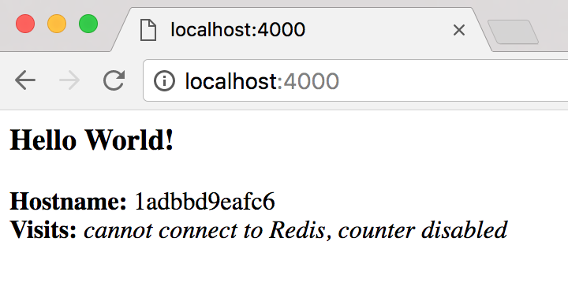
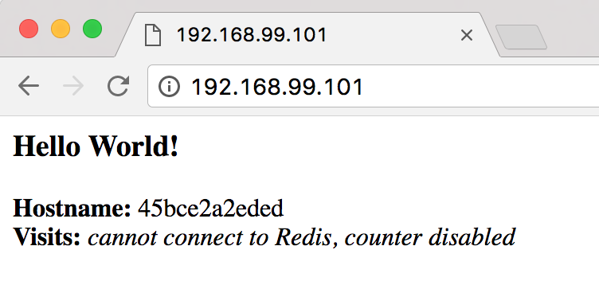
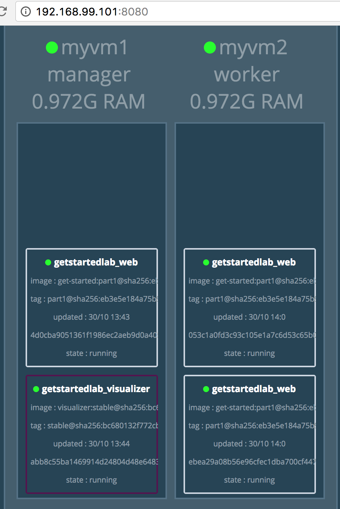
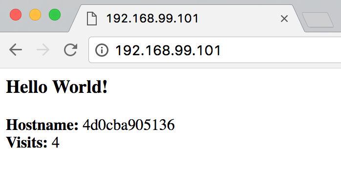

### Get Started
参考[Get started with docker](https://docs.docker.com/get-started/)
#### 1 Orientation
##### 1.1 简介
镜像（Image）： 镜像是一种轻量型的，独立的，可执行文件，包含你的App运行时所需要的一切，包括App代码，运行时环境，库，环境变量以及配置文件等。
容器（Container）： 镜像的一个运行时实例--即将镜像文件加载到内存并真正执行，默认情况下是不受宿主机器环境影响（只有在有额外配置的时候才会访问宿主机器的文件和端口）。
##### 1.2 容器与虚拟机对比
虚拟机VM： 每个虚拟机都运行在一个单独访客（Guest）操作系统之上的，由于每个VM都包含一个操作系统，所以VM会消耗更多的资源
Docker容器： 多个容器共享一个内核，容器镜像里只需要可执行的文件及它们的依赖，并且这些都不需要安装在宿主机器的操作系统上。由于一个容器包含了你所需要的一切依赖，不会和宿主机配置有任何的纠缠，可以说是一个容器话的App，很方便移植（Runs Anywhere）
（图）
##### 1.3 安装
选择桌面版for MAC OS：
[Install Docker for Mac](https://docs.docker.com/docker-for-mac/install/)
查看版本号
```
$ docker --version
Docker version 17.09.0-ce, build afdb6d4
```
运行如下命令，测试是否运行正常
```
$ docker run hello-world

Hello from Docker!
This message shows that your installation appears to be working correctly.

To generate this message, Docker took the following steps:
 ...(snipped)...
```
如果看到上述输出，说明docker可以正常运行了，可以继续后面的学习了。

#### 2 Containers
##### 2.1 Dockerfile
Dockerfile定义了Container的运行环境，如访问网络接口资源，Container的运行环境与外部系统是隔离的，所以需要映射端口到外部；另外还要定义那些文件需要包含Container里。
新建一个空目录并进入，然后创建创建一个Dockerfile并拷贝以下内容：
```
# Use an official Python runtime as a parent image
FROM python:2.7-slim

# Set the working directory to /app
WORKDIR /app

# Copy the current directory contents into the container at /app
ADD . /app

# Install any needed packages specified in requirements.txt
RUN pip install -r requirements.txt

# Make port 80 available to the world outside this container
EXPOSE 80

# Define environment variable
ENV NAME World

# Run app.py when the container launches
CMD ["python", "app.py"]
```
现在Dockerfile已经创建好了，里面引用了两个文件requirements.txt和app.py和没有创建，接下来创建这两个文件：

###### requirements.txt
```python
Flask
Redis
```
###### app.py
```python
from flask import Flask
from redis import Redis, RedisError
import os
import socket

# Connect to Redis
redis = Redis(host="redis", db=0, socket_connect_timeout=2, socket_timeout=2)

app = Flask(__name__)

@app.route("/")
def hello():
    try:
        visits = redis.incr("counter")
    except RedisError:
        visits = "<i>cannot connect to Redis, counter disabled</i>"

    html = "<h3>Hello {name}!</h3>" \
           "<b>Hostname:</b> {hostname}<br/>" \
           "<b>Visits:</b> {visits}"
    return html.format(name=os.getenv("NAME", "world"), hostname=socket.gethostname(), visits=visits)

if __name__ == "__main__":
    app.run(host='0.0.0.0', port=80)
```
我们所需要的就这些，不需要在系统的requirements.txt中包括Python或其他东西，也不需要构建或运行image在将其安装在本系统中。
##### 2.2 构建App
查看一下App目前包括的文件：
```
$ ls
Dockerfile       app.py           requirements.txt
```
仍然保持在当前目录，运行构建命令： build，这将创建一个Docker image，并通过-t选项给image一个友好的tag名字： friendlyhello
```
$ docker build -t friendlyhello .
Sending build context to Docker daemon  4.608kB
Step 1/7 : FROM python:2.7-slim
2.7-slim: Pulling from library/python
...(snipped)...
Step 2/7 : WORKDIR /app
...(snipped)...
Step 3/7 : ADD . /app
...(snipped)...
Step 4/7 : RUN pip install -r requirements.txt
...(snipped)...
Step 5/7 : EXPOSE 80
...(snipped)...
Step 6/7 : ENV NAME World
...(snipped)...
Step 7/7 : CMD python app.py
...(snipped)...
Removing intermediate container 9ada4039229b
Successfully built 709769b98e21
Successfully tagged friendlyhello:latest
```
build完成之后，查看本地image，会发行多了两个images： friendlyhello:latest和python和2.7-slim
```
$ docker images
REPOSITORY          TAG                 IMAGE ID            CREATED             SIZE
friendlyhello       latest              709769b98e21        2 hours ago         150MB
python              2.7-slim            e9adbdab327d        6 days ago          138MB
hello-world         latest              05a3bd381fc2        6 weeks ago         1.84kB
```
##### 2.3 运行App
运行App，同时通过-p选项用客户端端口4000映射到Container的发布端口80:
```
$ docker run -p 4000:80 friendlyhello
 * Running on http://0.0.0.0:80/ (Press CTRL+C to quit)
```
看到上面的输出，说明app已经启动成功，服务端口是80，这正是Dockerfile配置的。另外这个信息提示是container输出的，它不知道我们外面的端口映射，所以我们在访问时需要使用映射的端口4000： http://localhost:4000。


```
# add -d option make the app in the background, in detached mode
$ docker run -d -p 4000:80 friendlyhello
06a27095ba5e5744075caf7e463887888037b821b288fe4e78914dd6fb508b7a
```
当-d选项时，app运行在后端，并且返回long container ID，使用一下命令可以查看container的abbreviated ID
```
$ docker container ls
CONTAINER ID        IMAGE               COMMAND             CREATED             STATUS              PORTS                  NAMES
06a27095ba5e        friendlyhello       "python app.py"     31 seconds ago      Up 31 seconds       0.0.0.0:4000->80/tcp   adoring_jepsen
```
停止Container
```
$ docker container stop 06a27095ba5e
```

#### 2.3 分享App
* 首先注册一个Docker账号[sign up](https://cloud.docker.com/)，在命令行登陆，输入用户名和密码：
```
$ docker login
Login with your Docker ID to push and pull images from Docker Hub. If you don't have a Docker ID, [head over to](https://hub.docker.com) to create one.
Username : <yourname>
Password:
Login Succeeded
```
* 给image打标签，格式： username/repository:tag
```
$ docker tag friendlyhello <yourname>/get-started:part1
```
* upload image
```
$ docker push <yourname>/get-started:part1
```
* delete local image
```
$ docker image rm <image id>
```
* Pull and run the image from the remote repository
如果在本地没找到image，将从repo上拉取。
```
$ docker run -p 4000:80  <yourname>/repository:<tag>
Unable to find image '<yourname>/repository:<tag>' locally
part1: Pulling from <yourname>/repository
aa18ad1a0d33: Pull complete
942d41097fd2: Pull complete
da4c9a08866e: Pull complete
b5a45081af06: Pull complete
e56a682c999e: Pull complete
13889434f7e3: Pull complete
1bf8b337c5ea: Pull complete
Digest: sha256:eb3e5e184a75b9173b0f46f1cc4e450993914f6ee221f2fb1cb163f7ce12a268
Status: Downloaded newer image for donniechen/get-started:part1
 * Running on http://0.0.0.0:80/ (Press CTRL+C to quit)
```
注： 如果没有提供:tag部分, 默认是用g:latest，在build和run是都遵循这个规则。

##### 2.4 命令行汇总
```
docker build -t friendlyname .  # Create image using this directory's Dockerfile
docker run -p 4000:80 friendlyname  # Run "friendlyname" mapping port 4000 to 80
docker run -d -p 4000:80 friendlyname         # Same thing, but in detached mode
docker container ls                                # List all running containers
docker container ls -a             # List all containers, even those not running
docker container stop <hash>           # Gracefully stop the specified container
docker container kill <hash>         # Force shutdown of the specified container
docker container rm <hash>        # Remove specified container from this machine
docker container rm $(docker container ls -a -q)         # Remove all containers
docker image ls -a                             # List all images on this machine
docker image rm <image id>            # Remove specified image from this machine
docker image rm $(docker image ls -a -q)   # Remove all images from this machine
docker login             # Log in this CLI session using your Docker credentials
docker tag <image> username/repository:tag  # Tag <image> for upload to registry
docker push username/repository:tag            # Upload tagged image to registry
docker run username/repository:tag                   # Run image from a registry
```

#### 3 Services
##### 3.1 关于services
在分布式系统中，不同的App提供的功能通常叫“service”。
服务只是“生产中的容器”。服务只能运行一个映像，但它会编制映像运行的方式 - 应该使用哪些端口，容器应运行多少个副本，以便服务具有所需的容量，以及 等等。 缩放服务会更改运行该软件的容器实例数量，并为此过程中的服务分配更多的计算资源。

##### 3.2 docker-compose.yml ：
一个YAML格式的文件，定义Docker容器在生产环境的运行行为。创建一个docker-compose.yml文件，输入以下内容（ image需要替换）:
```
version: "3"
services:
  web:
    # replace username/repo:tag with your name and image details
    image: <yourname>/repository:<tag>
    deploy:
      replicas: 5
      resources:
        limits:
          cpus: "0.1"
          memory: 50M
      restart_policy:
        condition: on-failure
    ports:
      - "80:80"
    networks:
      - webnet
networks:
  webnet:
```
分析一下这个文件做了哪些工作？
1. 定义个名为web的service，并拉取image
2. 运行image的5个实例，并限制每个实例可以占用的系统资源，最多10%CPU和50M RAM
3. 重启策略，一旦失败就重启
4. 端口映射，将Host的80端口映射到web的80端口
5. 通过webnet在80端口使用负载均衡（在内部，containers将使用一个临时端口发布并对应到web的80端口）
6. 使用默认配置设置webnet
注： 关于版本version: "3"， 是为了swarm mode的兼容性

##### 3.3 启动可以负载均衡（load-balance）的app
1） 在运行docker stack deploy之前，先运行如下命令: docker swarm init
```
$ docker swarm init
Swarm initialized: current node (ond0jxtwizfx3s3kvwnii753z) is now a manager.

To add a worker to this swarm, run the following command:

    docker swarm join --token SWMTKN-1-4x0mrpbzcmguf6jv3fxqvb7yquwtjse6o1txxnh1fpe4q3b16d-5k4cjnr8ib7zsr1t5a9dcfcdg 192.168.65.2:2377

To add a manager to this swarm, run 'docker swarm join-token manager' and follow the instructions.
```
2） 启动服务并给App起个名字: docker stack deploy -c docker-compose.yml <app-name>
```
$ docker stack deploy -c docker-compose.yml getstartedlab
Creating network getstartedlab_webnet
Creating service getstartedlab_web
```
注1: 查看启动的服务列表
```
$ docker service ls
ID                  NAME                MODE                REPLICAS            IMAGE                          PORTS
hgg9qoz1vii1        getstartedlab_web   replicated          5/5                 donniechen/get-started:part1   *:80->80/tcp
```
注2： Docker swarms run tasks that spawn containers. Tasks have state and their own IDs:
```
$ docker service ps <service>
```
注3：  inspect one task and limit the output to container ID:
```
$ docker inspect --format="{{.Status.ContainerStatus.ContainerID}}" <task>
```
注4： inspect the container ID, and extract the task ID:
```
$ docker inspect --format="{{index .Config.Labels \"com.docker.swarm.task.id\"}}" <container>
```

注5： 列出所有containers，-q选项可以只列id
```
$ docker container ls -q
```

##### 3.4 动态收缩App
修改docker-compose.yml文件，修改replicas的值，然后重新运行docker stack deploy
```
$ docker stack deploy -c docker-compose.yml getstartedlab
Updating service getstartedlab_web (id: hgg9qoz1vii1d8xcsnus6nzks)
```
再次查看一下container，目前只剩下3个：
```
$ docker container ls -q
5a043873955c
2586b144f4c6
06a3c70c2a7d
```
##### 3.5 下架app和swarm
- 通过docker stack rm命令下架app
```
$ docker stack rm getstartedlab
Removing service getstartedlab_web
Removing network getstartedlab_webnet
```
注： 这样就把app删除了，但是swarm节点还在运行（可以通过docker node ls查看），使用以下命令可以干净地移除swarm节点：
```
$ docker node ls
ID                            HOSTNAME            STATUS              AVAILABILITY        MANAGER STATUS
ond0jxtwizfx3s3kvwnii753z *   moby                Ready               Active              Leader

$ docker swarm leave --force
Node left the swarm.

$ docker node ls
Error response from daemon: This node is not a swarm manager. Use "docker swarm init" or "docker swarm join" to connect this node to swarm and try again.
```
##### 3.6 命令汇总
```
docker stack ls                                            # List stacks or apps
docker stack deploy -c <composefile> <appname>  # Run the specified Compose file
docker service ls                 # List running services associated with an app
docker service ps <service>                  # List tasks associated with an app
docker inspect <task or container>                   # Inspect task or container
docker container ls -q                                      # List container IDs
docker stack rm <appname>                             # Tear down an application
docker swarm leave --force      # Take down a single node swarm from the manager
```
#### 4 Swarms
##### 4.1 了解什么是swarm集群
一个swarm就是一组运行Docker的机器聚合组成一个集群。在集群上运行的docker命令通过集群上的swarm manager执行。运行docker的机器可以是物理主机也可以是虚机，加入集群的机器被称为节点。
Swarm manager运行container节点有几种策略：
- “emptiest node” – which fills the least utilized machines with containers.
- “global”, which ensures that each machine gets exactly one instance of the specified container.

##### 4.2 设置swarm
- run ```docker swarm init``` to enable swarm mode and make your current machine a swarm manager.
- run ```docker swarm join``` on other machines to have them join the swarm as workers.

#### 4.3 创建集群
1） 使用docker-machine命令创建几个虚机，--driver选项指定驱动，这里选择VirtualBox driver：
```
$ docker-machine create --driver virtualbox myvm1
$ docker-machine create --driver virtualbox myvm2
```
2） 可以使用以下命令查看虚机的状态机相关参数
```
$ docker-machine ls
NAME    ACTIVE   DRIVER       STATE     URL                         SWARM   DOCKER        ERRORS
myvm1   -        virtualbox   Running   tcp://192.168.99.100:2376           v17.06.2-ce
myvm2   -        virtualbox   Running   tcp://192.168.99.101:2376           v17.06.2-ce
```
3） 初始化swarm并增加节点
让myvm1做为swarm manager，myvm2做为worker，通过```docker-machine ssh <vm_name>```可以向虚机发送命令。
- 让myvm1成为swarm manager
```
$ docker-machine ssh myvm1 "docker swarm init --advertise-addr 192.168.99.100"
Swarm initialized: current node (1ipl6j6ymioqnv2y42v0sqaq3) is now a manager.

To add a worker to this swarm, run the following command:

    docker swarm join --token SWMTKN-1-67dgczeoj34afu32tg5vn44giusk2n3c9iqpt6lnexcceyt5ym-f03se5ppjkwq8owo7lujn3q1m 192.168.99.100:2377

To add a manager to this swarm, run 'docker swarm join-token manager' and follow the instructions.
```
注： docker-machine ls返回的虚机ip信息中端口号是2376，这是Docker的守护进程。在运行```docker swarm init```和```docker swarm join```应该使用2377这个端口（Swarm管理端口），如果不指定则默认是2377.

- 设置myvm2为swarm work
上面命令的输出中包含了如何在swarm增加worker的命令，可以拷贝执行：
```
$ docker-machine ssh myvm2 "docker swarm join --token SWMTKN-1-67dgczeoj34afu32tg5vn44giusk2n3c9iqpt6lnexcceyt5ym-f03se5ppjkwq8owo7lujn3q1m 192.168.99.100:2377"
This node joined a swarm as a worker.
```
在swarm manager上执行docker node ls查看node信息：
```
$ docker-machine ssh myvm1 "docker node ls"
ID                            HOSTNAME            STATUS              AVAILABILITY        MANAGER STATUS
1ipl6j6ymioqnv2y42v0sqaq3 *   myvm1               Ready               Active              Leader
phw3t0iy2wxjnmf6gpyuepoud     myvm2               Ready               Active
```
##### 4.4 在集群中部署app
1） 设置swarm manager的运行主机的shell环境
除了使用```docker-machine ssh <vm-machine>```在swarm manager，还可以选择使用```docker-machine env <vm-machine>```，后者可以使用本地docker-compose.yml远程部署应用。
在mac或linux上可以如下设置：
```
$ docker-machine env myvm1
export DOCKER_TLS_VERIFY="1"
export DOCKER_HOST="tcp://192.168.99.100:2376"
export DOCKER_CERT_PATH="~/.docker/machine/machines/myvm1"
export DOCKER_MACHINE_NAME="myvm1"
```
上述命令的输出如下：
```
export DOCKER_TLS_VERIFY="1"
export DOCKER_HOST="tcp://192.168.99.100:2376"
export DOCKER_CERT_PATH="/Users/donnie/.docker/machine/machines/myvm1"
export DOCKER_MACHINE_NAME="myvm1"
# Run this command to configure your shell:
# eval $(docker-machine env myvm1)
```
根据提示运行```eval $(docker-machine env myvm1)```实现配置：
```
$ eval $(docker-machine env myvm1)
```
运行```docker-machine ls```确认myvm1是当前Active主机，Active状态标识为*：
```
$ docker-machine ls
NAME    ACTIVE   DRIVER       STATE     URL                         SWARM   DOCKER        ERRORS
myvm1   *        virtualbox   Running   tcp://192.168.99.100:2376           v17.06.2-ce
myvm2   -        virtualbox   Running   tcp://192.168.99.101:2376           v17.06.2-ce
```
2) 通过swarm manager部署App
- 切换到myvm1 shell
```
$ eval $(docker-machine env myvm1)
```
- 在myvm1上执行部署命令
```
$ docker stack deploy -c docker-compose.yml getstartedlab
```
- 部署成功后，可以查看部署的services，可以发现services分布到了两个节点上
```
$ docker stack ps getstartedlab
ID                  NAME                  IMAGE                          NODE                DESIRED STATE       CURRENT STATE           ERROR               PORTS
soxdrlp1xjwr        getstartedlab_web.1   donniechen/get-started:part1   myvm1               Running             Running 2 minutes ago
o8ednq7pf409        getstartedlab_web.2   donniechen/get-started:part1   myvm2               Running             Running 2 minutes ago
c1zjbvl2kn3a        getstartedlab_web.3   donniechen/get-started:part1   myvm2               Running             Running 2 minutes ago
```
##### 4.5 访问集群
由于有负载均衡，我们可以通过任一虚机ip访问app（routing mesh），http://192.168.99.101，通过刷新可以观察，node id也在切换，证明负载的轮训机制是正常的。



##### 4.6 迭代和缩放App
可以修改docker-compose.yml文件中的并发数调整services的数量
增加虚机或主机worker，增加节点数量
##### 4.7 清理和重启
- Stacks and swarms
使用```docker stack rm```销毁stack
```
$ docker stack rm getstartedlab
```
- 取消虚机的环境变量设置
```
$ eval $(docker-machine env -u)
```
- 启动停止的虚机
```
$ docker-machine start <machine-name>
```
#### 4.8 常用命令
```
docker-machine create --driver virtualbox myvm1 # Create a VM (Mac, Win7, Linux)
docker-machine create -d hyperv --hyperv-virtual-switch "myswitch" myvm1 # Win10
docker-machine env myvm1                # View basic information about your node
docker-machine ssh myvm1 "docker node ls"         # List the nodes in your swarm
docker-machine ssh myvm1 "docker node inspect <node ID>"        # Inspect a node
docker-machine ssh myvm1 "docker swarm join-token -q worker"   # View join token
docker-machine ssh myvm1   # Open an SSH session with the VM; type "exit" to end
docker node ls                # View nodes in swarm (while logged on to manager)
docker-machine ssh myvm2 "docker swarm leave"  # Make the worker leave the swarm
docker-machine ssh myvm1 "docker swarm leave -f" # Make master leave, kill swarm
docker-machine ls # list VMs, asterisk shows which VM this shell is talking to
docker-machine start myvm1            # Start a VM that is currently not running
docker-machine env myvm1      # show environment variables and command for myvm1
eval $(docker-machine env myvm1)         # Mac command to connect shell to myvm1
& "C:\Program Files\Docker\Docker\Resources\bin\docker-machine.exe" env myvm1 | Invoke-Expression   # Windows command to connect shell to myvm1
docker stack deploy -c <file> <app>  # Deploy an app; command shell must be set to talk to manager (myvm1), uses local Compose file
docker-machine scp docker-compose.yml myvm1:~ # Copy file to node's home dir (only required if you use ssh to connect to manager and deploy the app)
docker-machine ssh myvm1 "docker stack deploy -c <file> <app>"   # Deploy an app using ssh (you must have first copied the Compose file to myvm1)
eval $(docker-machine env -u)     # Disconnect shell from VMs, use native docker
docker-machine stop $(docker-machine ls -q)               # Stop all running VMs
docker-machine rm $(docker-machine ls -q) # Delete all VMs and their disk images
```
#### 5 Stacks
##### 5.1 介绍
stack: 一个stack是一组相关服务，它们共享依赖，在一起可以编排和缩放。一个stack即可定义和协调整个应用的功能（有些复杂的应用可能需要多个堆栈）。
##### 5.2 增加一个新的服务并部署
1） 首先新增一个免费的visualizer服务，重新打开编辑docker-compose.yml文件，在services节（与web并列）增加以下配置：
```
visualizer:
  image: dockersamples/visualizer:stable
  ports:
    - "8080:8080"
  volumes:
    - "/var/run/docker.sock:/var/run/docker.sock"
  deploy:
    placement:
      constraints: [node.role == manager]
  networks:
    - webnet
```
上面的配置增加了两个新的东西：
- a volumes key: 给visualizer访问Docker的主机套接字文件的权限
- a placement key: 确保这个服务只运行在swarm manager上，而不是worker上
2) 切换到myvm1 shell环境（每次切完之后最好通过docker-machine ls观察验证一下）
```
eval $(docker-machine env myvm1)
```
3) 运行部署命令：docker stack deploy
```
$ docker stack deploy -c docker-compose.yml getstartedlab
Updating service getstartedlab_visualizer (id: n2tl28mm6ltdf96tx70vwc9fm)
Updating service getstartedlab_web (id: u9c8ab169ewfu8oo6sqzgeej4)
```
4) 在浏览器观察测试一下: http://192.168.99.101:8080/

##### 5.3 持久化数据
1) 之前的逻辑增加了redis访问，但是redis服务没有启动，本机将增加这个服务保存app的数据。打开并编辑docker-compose.yml文件，在services节（与web和visualizer并列）增加redis配置，如下：
```
redis:
  image: redis
  ports:
    - "6379:6379"
  volumes:
    - ./data:/data
  deploy:
    placement:
      constraints: [node.role == manager]
  networks:
    - webnet
```
redis image现在是一个官方认可Docker库，并且授权使用redis这个简短的名字，不需要指定username/repo。有几点需要注意一下：
- redis总是运行在manager上，这样就保证总是用同一文件系统
- redis访问container里host主机的文件系统，如/data目录

另外还需要注意，
- 为持久化redis数据，redis应该写入host主机的文件系统而不是container的/data目录下：
- 还有为container的/data目录建立一个host主机的映射

2) 在manager上建立./data文件夹
```
docker-machine ssh myvm1 "mkdir ./data"
```
3) 切换到myvm1的shell环境
```
eval $(docker-machine env myvm1)
```
4) 重新部署
```
docker stack deploy -c docker-compose.yml getstartedlab
```
5) 在浏览器访问



#### 6 Deploy you app
